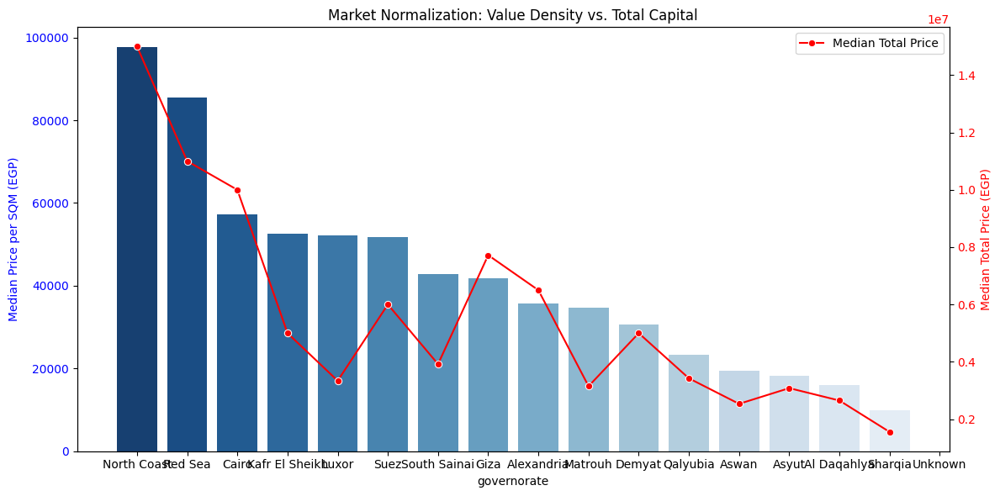
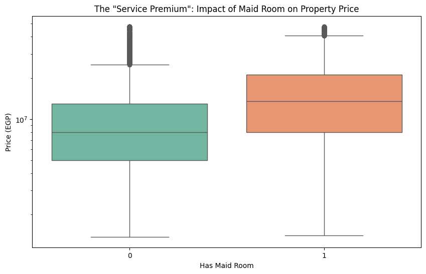
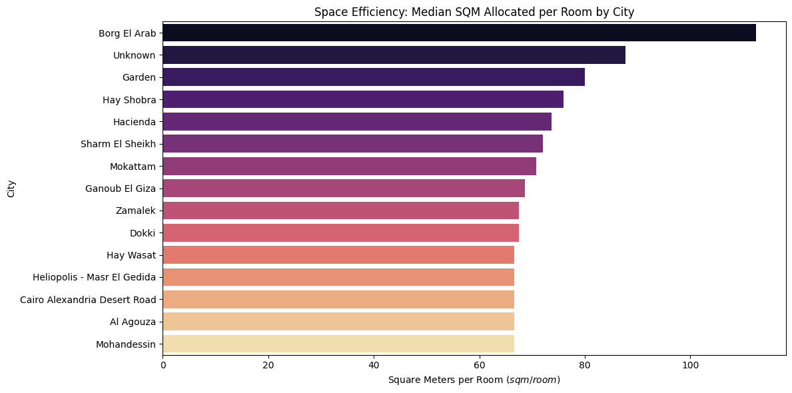
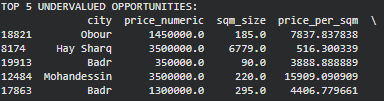

# 🏠 Egyptian Real Estate Market Analysis

## 📌 Project Overview
This project provides a comprehensive data-driven investigation into the Egyptian property market. By analyzing over 20,000+ scraped listings, the study moves beyond basic statistics to uncover the underlying "market logic" that dictates property pricing across different regions.

## 🛠 1. Data Engineering & Cleaning
**The raw data contained significant noise (complex strings, mixed units, and outliers). The pipeline includes:**

- **Dimensional Normalization: Split mixed size strings into clean sqft_size and sqm_size numeric columns.**

- **Room Extraction: Applied logic to extract total_rooms_numeric from complex strings like "3+ Maid" and handled "Studio" types.**

- **Feature Engineering: * has_maid: A binary flag for service quarters.**

- **price_per_sqm: Normalizing cost across different property sizes.**

- **sqm_per_room: Measuring architectural "sprawl" vs. "utility."**

- **Geospatial Parsing: Used negative indexing to reliably extract Governorate, City, and Compound names from unstructured location strings.**

---

## 📊 2. Market Deep Dive

### **1. Market Normalization: Value Density vs. Total Capital**

This analysis evaluates where the most expensive land is located (Price per SQM) compared to where the highest total investment is required (Total Price).

> **Description:** The dual-axis chart compares the median price per square meter (blue bars) against the median total property price (red line) across Egyptian governorates.

**Conclusions:**
* **The North Coast** represents the highest "Value Density" in Egypt, commanding nearly **100,000 EGP per SQM**, which also corresponds to the highest median total price.
* **Cairo and Giza** show a decoupling; while Cairo has high value density, Giza has a higher median total price, likely due to larger property sizes (villas) despite lower per-meter costs.
* **Governorates like Sharqia** represent the most affordable entry points, with the lowest median values in both categories.

---

### **2. The "Service Premium": Impact of Maid Rooms**

This analysis quantifies the luxury tiering of the market based on specific amenities.

> **Description:** A box plot on a logarithmic scale compares the price distribution of properties with a maid's room (1) versus those without (0).

**Conclusions:**
* Properties with a maid's room have a significantly higher median price, firmly placing them in the **"Premium" tier**.
* The **price floor** for properties with a maid's room is higher than the median price for those without, indicating that this feature is a primary separator between standard and luxury inventory.

---

### **3. Space Efficiency: Median SQM per Room by City**

This metric investigates the "Efficiency" of floor plans—how much physical space is allocated to each functional room.

> **Description:** The horizontal bar chart ranks cities by the median square meters allocated per room.

**Conclusions:**
* **Borg El Arab** leads in "Sprawl," with over **110 SQM per room**, indicating very large, possibly industrial-scale residential spaces.
* **Elite districts (Zamalek, Dokki, Garden City)** show a standardized "Luxury Efficiency" of **~70–80 SQM per room**, reflecting classic, spacious architectural styles.
* **Modern hubs (Heliopolis, New Cairo)** are more compact **(~65 SQM/room)**, suggesting a move toward modern, high-utility apartment designs.

---

### **4. Investment Opportunity (The Deal Finder)**

This identifies market anomalies where properties are priced significantly below their local neighborhood average.

> **Description:** A statistical output identifying "Strong Deals" where the price per SQM is significantly lower than the city median (Z-Score < -1.5).

**Conclusions:**
* The model successfully identified extreme value opportunities, such as a listing in **Hay Sharq at only 516 EGP per SQM** and one in **Badr at 3,888 EGP per SQM**.
* **6 October** remains the most balanced market, offering the most affordable entry point for both compound and non-compound inventory.
* *Note:* High-end area anomalies (e.g., Mohandessin) may indicate distressed sales or data entry errors that require further qualitative verification.

---

## 💡 3. Summary Conclusions

* **Geographic Divergence:** Egypt is a split market; rural/delta governorates (like Qalyubia) value **Size**, while prestige hubs (Cairo/North Coast) value **Utility and Room Count**.
* **Functional Priority:** In Cairo, total square footage is nearly irrelevant to price ($0.00$ correlation), whereas **Bedroom Count ($0.53$)** and **Bathroom Count ($0.52$)** are the true price anchors.
* **Premium Thresholds:** The presence of a maid's room and the number of bathrooms act as the strongest proxies for luxury, showing higher correlations with price than total bedrooms.
* **Efficiency Shift:** Modern Egyptian real estate is trending toward **"High-Utility Efficiency,"** with newer cities maximizing room counts within smaller footprints compared to older, spacious districts.

